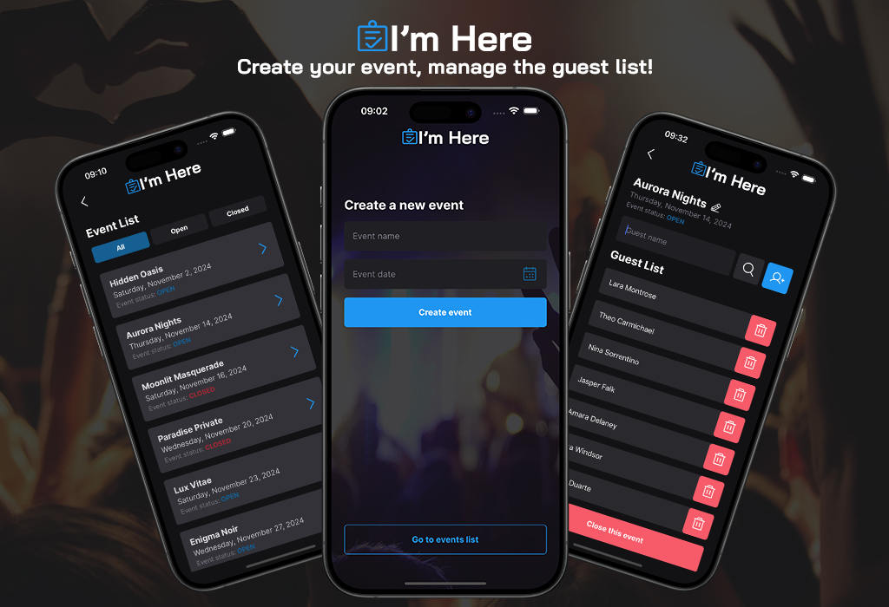

<div align="center" style="margin-bottom: 20px;">
  <div>
    
  </div>
  </br>
  <div align="center">
    
    
    
    
    
    
  </div>
</div>

## :memo: About project

**I'm Here** is a React Native application designed to help you organize and manage events directly from your smartphone. With an intuitive interface, it allows you to create custom events, add and manage your guest list, and provides a range of features to make event tracking easier.

**Key Features:**

- Create and customize events, with the option to edit event names.
- Easily add and remove participants.
- Search by name to quickly locate participants.
- Update event and participant status for better control.
- Local data storage with SQLite, ensuring offline access and data persistence.

I'm Here is designed as a practical and complete event management tool, streamlining the organization process and making it more accessible on mobile devices.



## ⚡ Technologies Used

- [React Native](https://reactnative.dev/)
- [TypeScript](https://www.typescriptlang.org/)
- [SQLite](https://www.sqlite.org)
- [Expo](https://expo.dev/)
- [React Navigation](https://reactnavigation.org)
- [Phosphor Icons](http://phosphoricons.com)
- [Styled Components](http://styled-components.com)

## :cyclone: Run this project

To run the project, you’ll need a pre-configured Android or iOS emulator. Make sure the emulator is open before starting. Then:

1. Run `npm run start` to launch the project;
2. Press **"i"** to open it in the iOS emulator or **"a"** for the Android emulator.

This will start the app in the selected emulator.

```bash
# clone this repository
git clone https://github.com/jefferson1104/imhere-app-mobile.git

# go to the folder
cd imhere-app-mobile

# install dependencies
$ npm install

# run app
$ npm run start
```

## 📸 ScreenShots

<image src="./src/assets/images/image-01.png" width="300" />
<image src="./src/assets/images/image-03.png" width="300" />
<image src="./src/assets/images/image-02.png" width="300" />
